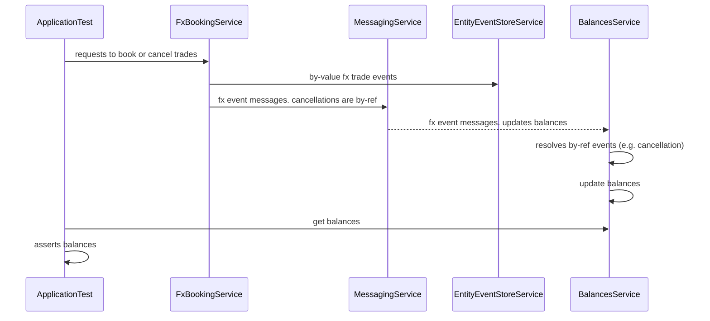

# FX Trade Tech Interview

This is my attempt to improve on the solution given during the session (I just couldn't leave it alone!). 
It's still a toy example, but at least there is some separation of concerns, better abstractions and lot more tests!

[ApplicationTest](src/test/kotlin/ApplicationTest.kt) is perhaps the most comprehensive integration test. 

## Structure 
The structure is strictly object-oriented as I felt this may be a familiar approach for most.
I can do a functional implementation as a separate exercise.

Here is the sequence diagram for the flow:



## Running the Tests

```bash
./gradlew test
```
